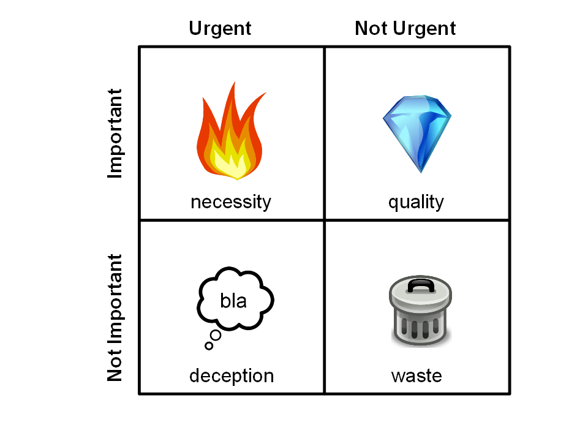

# Prioritizing with the Covey Matrix

Most probably, you have more to do than you would like to. This is normal for most people. But not everybody lives comfortably with that. The Covey Matrix is a tool that helps you prioritize your work and brings you back into charge.

## How it works:

Draw a table with four quadrants, and sort each of your tasks into one. The four quadrants are:

* **Necessity** (urgent and important): Emergencies, deadlines, well-prepared meetings. These need to be done first.
* **Quality** (important): Planning, implementation, and your own development. Maximize the time spent in this area, because it generates value in the long run.
* **Deception** (urgent): emails, paperwork, badly prepared meetings. Try to get rid of as much as possible.
* **Waste** (not urgent and not important): Browsing. Reading random posts on Facebook. Junk mails. Waste is toxic. Don't touch it! If you need a break, find yourself a distraction that has nothing to do with computers.

Assigning tasks to the four quadrants is a good way to quickly make a plan for the day - especially the first day after vacations. It also works for 'Mail Box'-type exercises found in job assessments (you get a heap of taks and have to prioritize or allocate resources, and of course you have too little of everything).

The Covey Matrix is a true classic from time management. Used consequently, it can make your work day a lot more pleasant.
