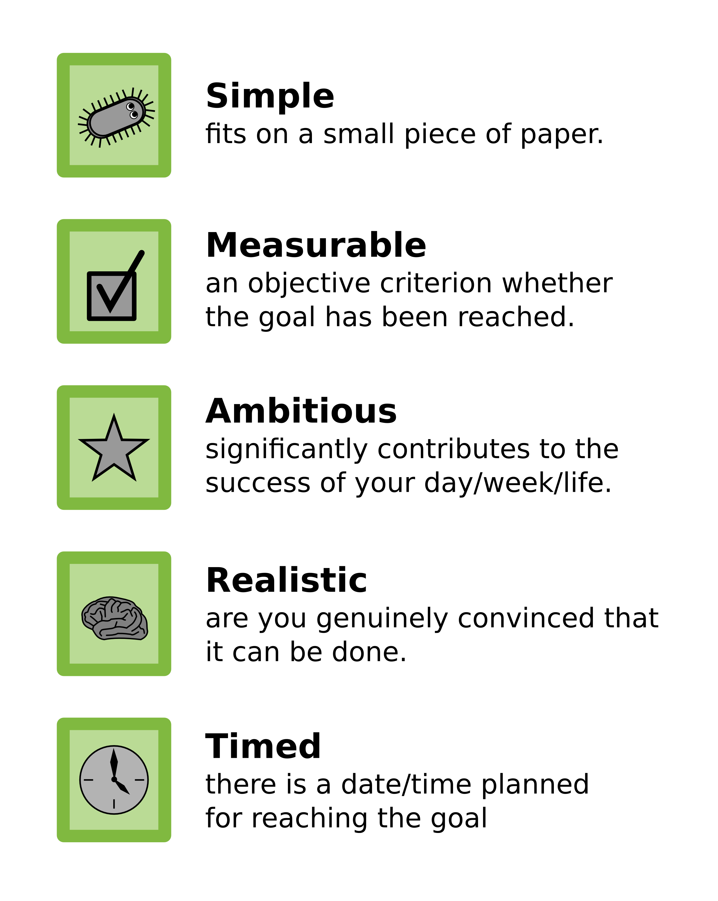

# SMART Goals

## How to create objective, measurable project goals

When you talk about or write down project goals, it is very tempting to make general statements such as *"finish the experiment"*, *"write chapter 3"*. Such goals, however, are problematic: When *exactly* is the experiment finished? What does it mean that the chapter is written? Those hidden, implicit questions give us a strong incentive to stick to the goal more sloppily than we initially had in mind: we end up procrastrinating part of the work, tell we reached the goal, and thereby quality suffers.
SMART goals offer a possible way out. Write project goals that fulfill the **five SMART criteria:**

### Simple

Your goal is **simple** if it can be understood by a person not involved. You need to be able to explain the goal to a lay person in one or two minutes, otherwise it is not simple. This does not mean that anyone must be able to perform a given task, but understand what you want to achieve.

### Measurable
    
Your goal is **measurable** if there is an objective criterion that determines whether the goal has been reached. Measurable goals include Deliverables (physical objects such as samples, reagents, or devices and electronic files). Naturally, numbers are also measurable ("We've collected 10 impact points"). Finally a goal can be reached by a defined communication event, e.g. ("My supervisor confirms the thesis is ready to print.", "I announce to the team that the samples are ready.").

### Ambitious
    
Your goal is **ambitious** if you have an answer to the question: Why does this make your project/your team/you better? What s the benefit? Is there an edge you gain over the competition? If you want to make your stand and defend your goal against doubt, it probably is ambitious.
    
### Realistic

Your goal is **realistic** if all participants sincereley agree that the goal can be reached on time with the given resources. Realistic means that false consensus and lip service to a goal need to be ruled out. Be honest to yourself: Do you believe it can be done? If you want to know whether other people in the project believe the goal is realistic, the coffee break is a better occasion to ask than a conference table.
    
### Timed
    
Your goal is **timed** if there is a concrete date or time until when the goal is to be reached. Not more, no less. If you cannot come up with a timebox that is realistic to you, probably it is worth to cut the goal into smaller pieces.

### Conclusion

SMART goals are a fundamental tool for managing projects of all kind. They give you hard criteria by which a project can be tracked. That makes SMART goals excellent when planning work with people you supervise. You can revisit the same goals later and objectively observe what has happened. On the downside, SMART goals create pressure. SMART goals keep pushing you, and if you lose track, work gets frustrating quickly. To keep the pressure positive (in the sense of driving you and your team forward), try SMART goals for yourself first, try small goals, and try easy goals. By formulating small stepping stones in the SMART way, you can get a lot done, and know it. 