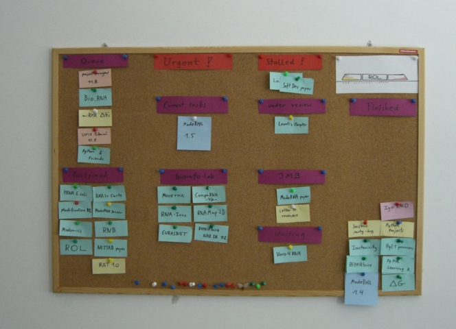

# Using a Task Board

As a postdoc, I was struggling with coordinating more than 10 projects, and the workload and multitasking were dragging me down. After some time I decided to do something about it, and the method that worked well was creating a **task board** where I placed all the work that had queued up. Then I started doing it, one task at a time.

A task board helps a team to keep track of progress in a project. You basically write tasks on paper cards and attach or pin them to a board. The board is divided in three sections: **Todo**, **Work in Progress** and **Done**. All tasks start in the Todo section and move as the project progresses. On my board there were a few special columns for tasks colleagues or reviewers were taking care of, but the basic structure is the same.

It may be tempting to use whatever electronic tool for the board, but don’t! The main function of the board is to constantly remind you and your team of what you are working on. I have seen task boards on a lab wardrobe, or above a desk on a pin board, and both worked fine.

The board is a great tool to detect bottlenecks. So if you start using a board you may recognize that your tasks don’t move or move very slowly. This is normal, and the board helps you to improve your work efficiency. It helps to keep tasks anonymous, i.e. not assigned to a particular person. This encourages people to help each other and protects them from blame when something they worked on doesn’t progress as expected.

If you want to speed up improvement, you can limit the number of tasks in the work-in-progress column. This is done in **Kanban**, a method used in lean manufacturing and software development. The limit helps to focus on the tasks at hand, especially when there is a lot of pressure by deadlines etc.
