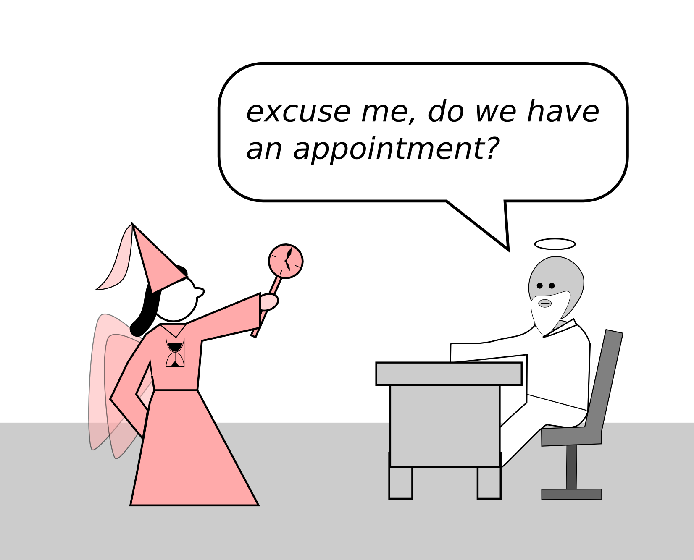

# When the Time Fairy comes

There are special moments when the Time Fairy grants you a short period of time in which you are hyper productive. There are four different conditions that might contribute to hyper-productivity.

### Creative time

Many things in science require creativity. To be creative, three things may help you:

* a stimulating environment (clean or messy, quiet or lively, whatever you prefer). 
* little pressure (no deadlines, no imminent tasks)
* often, constraints help (e.g. no computers, drawing on paper, a 60-minute time box)
	
### High-performance hours

Every person has their time of the day when they are most productive. That time varies from one person to another, so you need to find out when they are (e.g. using a time log).

It makes sense to schedule your most difficult and most important tasks into your high-performance hours.

### Interruption-free time

Knowing that you won't be interrupted is a great plus to get many tasks done. Closing the door, being absent, telling people in advance that you won't be available are ways to get there. Keeping your high-performance hours free of interruptions might make up for half of your time management.

### Moments of opportunity

It happens often that our plans change on the fly: a train is delayed, a meeting is cancelled, you need to wait for an experiment longer than expected. These are normal things to happen. You may treat these moments as gifts. You can be prepared to make good use of the extra time: pull out that article you needed to read. Carry a notepad with you to make sketches for your figures or even a copy of your data. Sometimes the best ideas arrive in these unexpected moments. Let yourself be surprised!

You cannot always predict when the Time Fairy knocks. But knowing that such moments occur, you can be prepared for them. Leave your door open, and when the Time Fairy knocks, **seize the moment**!

